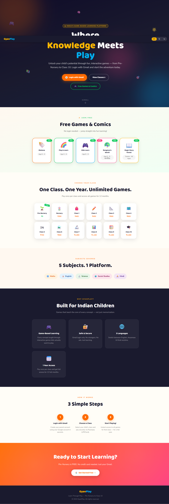
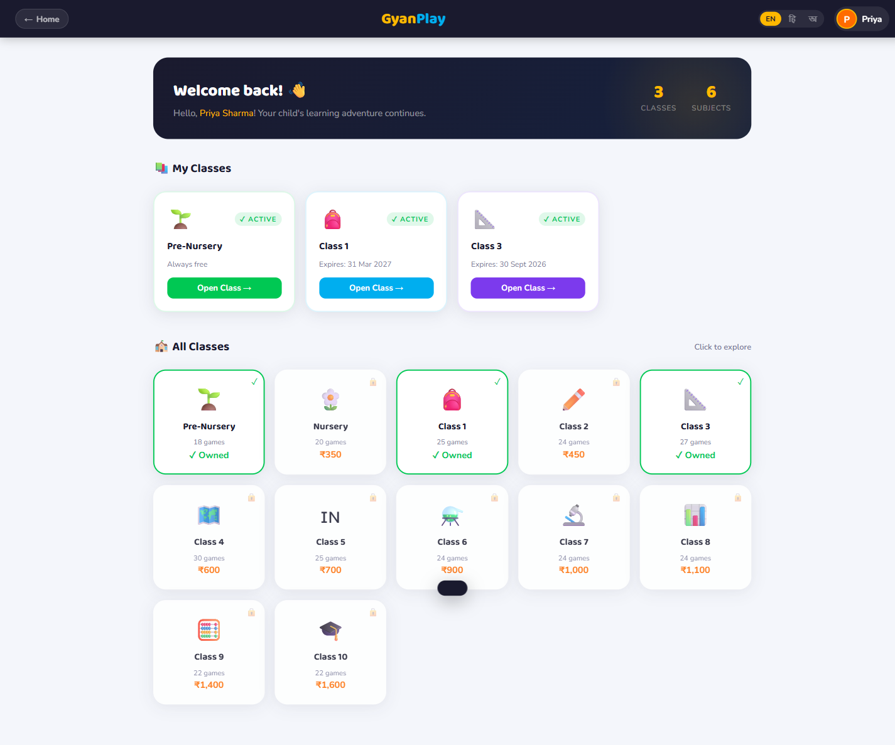
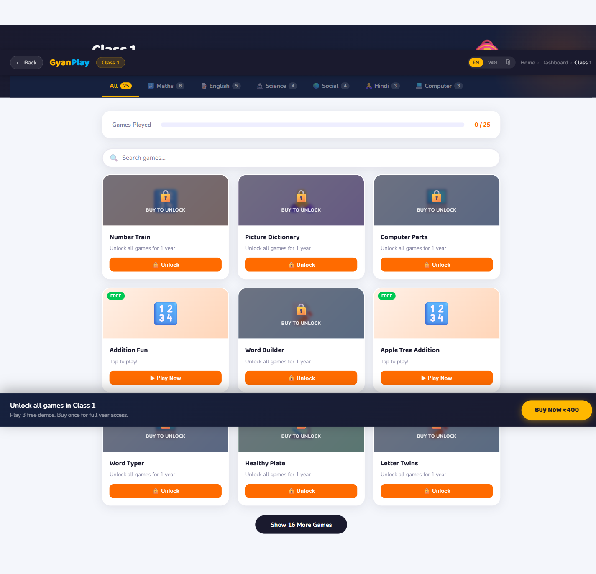
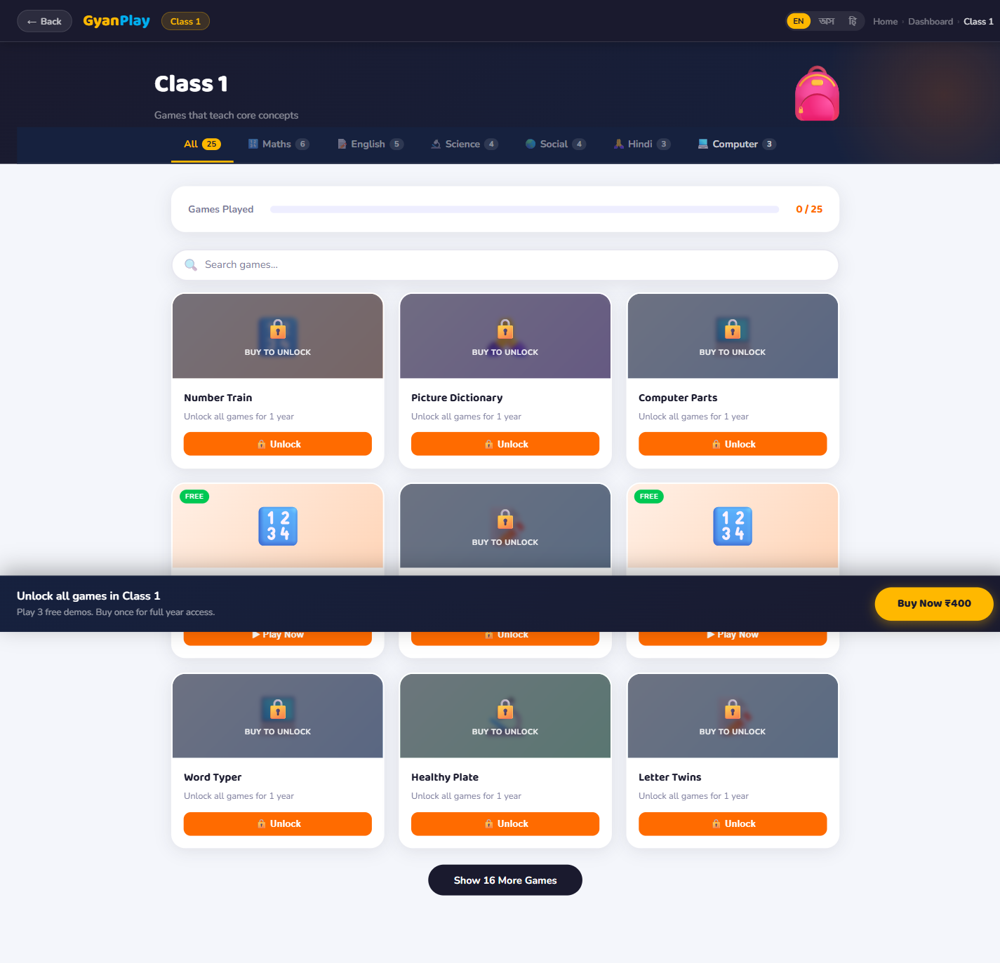
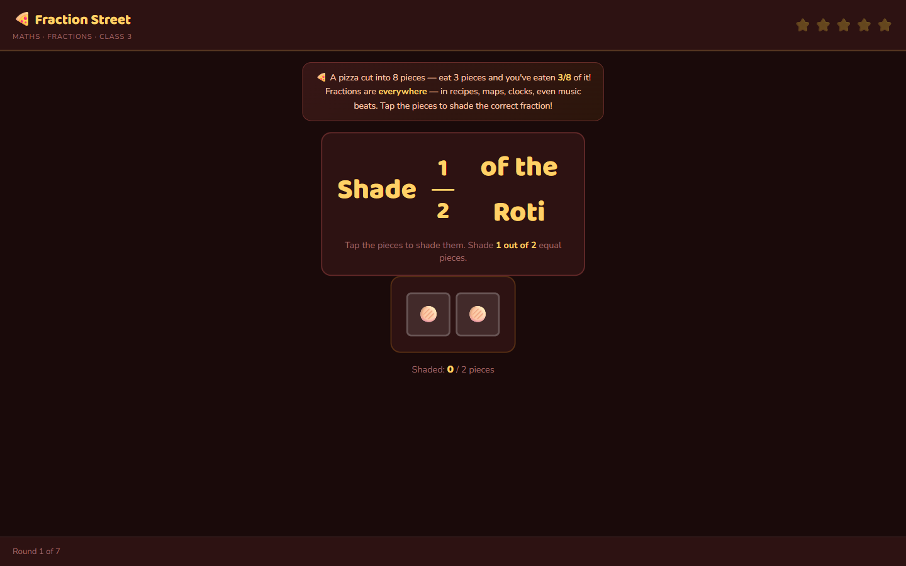
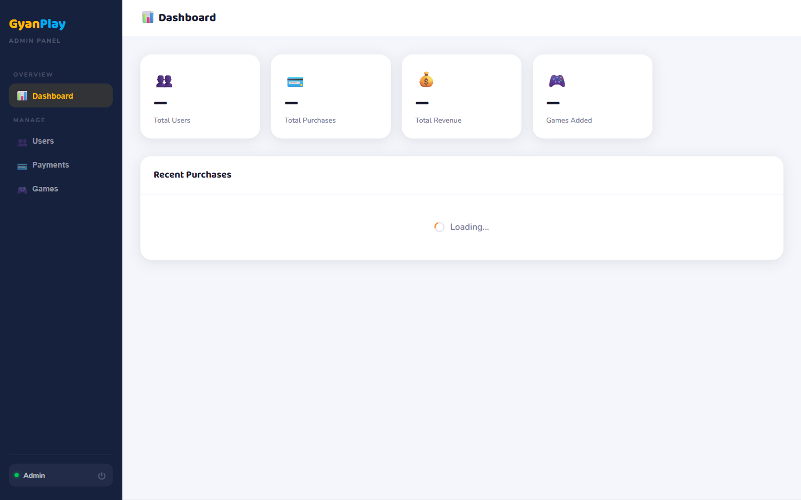

# 🏫 GyanPlay

> A game-based learning platform for Indian children (Pre-Nursery → Class 10), built around the CBSE / NCERT syllabus with trilingual support in **English, हिंदी, and অসমীয়া**.

Every chapter maps to a playable browser game. An AI teacher (scoped to the student's class) is available for follow-up questions. Parents own a dashboard; admins curate the game catalogue.

<!-- Replace with your deployed URL when live -->
**Live demo:** _coming soon_ &nbsp;•&nbsp; **Status:** pre-launch

---

## 📸 Screenshots

> Drop screenshots into `docs/screenshots/` and the paths below will render.

| Landing | Dashboard | Classroom |
|---|---|---|
|  |  |  |

| AI Teacher chat | Game (Class 3 — Fractions) | Admin panel |
|---|---|---|
|  |  |  |

---

## ✨ What it does

- **200+ educational mini-games** across 12 class levels, organised by subject (Maths, English, Science, Social Studies, Hindi, Computer, Assamese).
- **Trilingual UI** — every game supports English / Hindi / Assamese. Assamese is rare in ed-tech and is a first-class citizen here.
- **AI Teacher** — a Groq-powered chatbot scoped to the student's current class, so explanations stay age-appropriate and syllabus-relevant.
- **Parent dashboard** — track owned classes, see expiry, see recently played games.
- **Admin panel** — add / edit games, manage users, view revenue.
- **Razorpay checkout** — ₹500/year per class (UPI / card / net-banking).

---

## 🛠️ Tech stack

| Layer | Choice |
|---|---|
| Frontend | Vanilla HTML / CSS / JS (no framework — fast cold-loads on low-end Android) |
| Auth | Firebase Auth (Google, Gmail-only) |
| Database | Cloud Firestore |
| Backend | Firebase Cloud Functions (Node 20, Gen 2) |
| AI | Groq API (`llama-3.3-70b-versatile`) via server-side proxy |
| Payments | Razorpay |
| Hosting | Netlify (static) + Firebase (functions + Firestore) |

Why vanilla JS? Target audience is parents on ₹6k Android phones in tier-2/tier-3 towns — shipping 300 KB of React would be hostile. Every page is hand-tuned.

---

## 🧱 Architecture

```
Browser (classroom.html)
   │
   │  Firebase ID token
   ▼
Cloud Function ── aiTeacherChat ──► Groq API
   │ (verifies auth,                (key lives in Secret Manager)
   │  checks Firestore purchase,
   │  rate-limits in future)
   │
   ▼
Firestore (users / purchases / classes / played / admins)
   ▲
   │  Firestore rules gate every read/write by UID
   │
Browser (dashboard.html, payment.html, admin.html)
```

Full project map: [`gyanplay_project_map.svg`](gyanplay_project_map.svg).

### Showcase files

- [`functions/index.js`](functions/index.js) — AI Teacher proxy. Verifies Firebase ID token → checks Firestore purchase → forwards to Groq. The API key never touches the browser.
- [`firestore.rules`](firestore.rules) — strict per-UID access control.
- [`classroom.html`](classroom.html) — the classroom shell: syllabus grid, game iframe, AI chat, language switcher.
- [`src/payment.js`](src/payment.js) — Razorpay integration (webhook-verified writes planned).

---

## 🚀 Quick start (local)

```bash
git clone <repo-url> gyanplay
cd gyanplay

# 1. Open any page directly — it's static HTML
#    Use a local server so ES modules and Firebase work:
npx serve .
# → open http://localhost:3000
```

The app boots in a "no-config" mode as-is. To make auth / payments / AI work, you'll need to plug in your own keys (below).

---

## 🔑 Configuration

All keys are **yours to add** — the repo ships with placeholders.

| What | Where | How to get it |
|---|---|---|
| Firebase config | [`src/firebase.js`](src/firebase.js) | Firebase Console → Project Settings → General → Your apps |
| Razorpay Key ID | [`src/payment.js:44`](src/payment.js#L44) | Razorpay Dashboard → Settings → API Keys |
| Groq API key | **Secret Manager, never in code** | `firebase functions:secrets:set GROQ_API_KEY` |

> ℹ️ The Firebase `apiKey` in `src/firebase.js` is safe to commit — web API keys are public identifiers. Real security lives in [`firestore.rules`](firestore.rules) and [Firebase App Check](https://firebase.google.com/docs/app-check).

### Deploying the Cloud Function

```bash
cd functions
npm install
firebase functions:secrets:set GROQ_API_KEY   # paste the key once, stored encrypted
firebase deploy --only functions
```

Update the endpoint URL in [`classroom.html`](classroom.html) (search for `AI_TEACHER_ENDPOINT`) if your Firebase project isn't `gyanplay-prod`.

---

## 📁 Project structure

```
gyanplay/
├── index.html              Landing
├── login.html              Gmail login
├── dashboard.html          Parent dashboard (auth required)
├── classroom.html          Games + AI Teacher (auth + paid)
├── payment.html            Razorpay checkout
├── admin.html              Admin panel (admin UIDs only)
├── src/
│   ├── firebase.js         Firebase client config
│   ├── auth.js             Google sign-in helpers
│   └── payment.js          Razorpay checkout
├── functions/              Cloud Functions (Node 20, Gen 2)
│   └── index.js            aiTeacherChat proxy
├── gyanplay-games/         200+ per-class HTML mini-games
├── comics-games/           Interactive comic-style games (age 3–9)
├── data/                   Games catalogue JSON
├── firestore.rules         Security rules
└── firebase.json           Firebase Hosting + Functions config
```

---

## 🗺️ Roadmap

- [x] Trilingual UI (English / Hindi / Assamese)
- [x] 200+ games across all class levels
- [x] AI Teacher with server-side key isolation
- [x] Firestore rules for per-user data
- [ ] Razorpay webhook → Firestore write (lock out client-side purchase forgery)
- [ ] Rate limiting on AI Teacher (per-user/minute)
- [ ] Enable Firebase App Check
- [ ] Progress reports for parents (weekly email digest)
- [ ] Offline mode for rural users (service worker + cached games)

---

## 🔒 Security posture

- API keys: Groq key lives in Firebase Secret Manager; all calls go through an authenticated Cloud Function.
- Auth: Google sign-in, Gmail accounts only.
- Firestore: per-UID read/write rules; admin collection gates privileged writes.
- Payments: Razorpay signature verification planned server-side before purchase doc is written (see roadmap).

If you spot a vulnerability, please open an issue.

---

## 📝 License

TBD — not yet published under an OSS license.

---

Built with care for kids in Assam and beyond. 🌱
